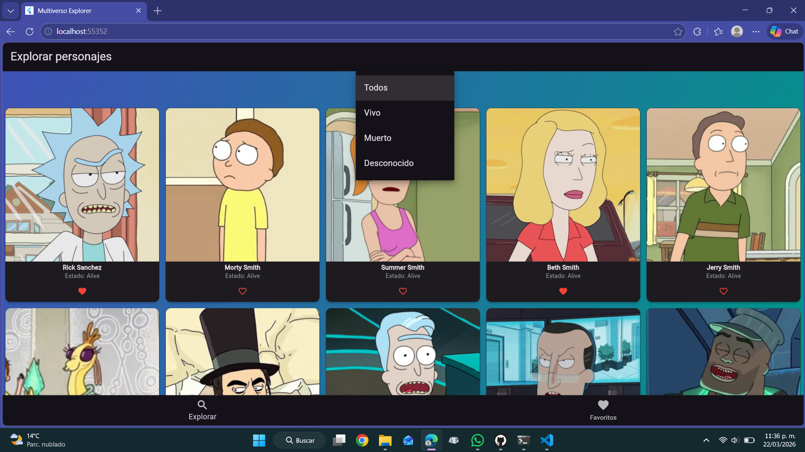
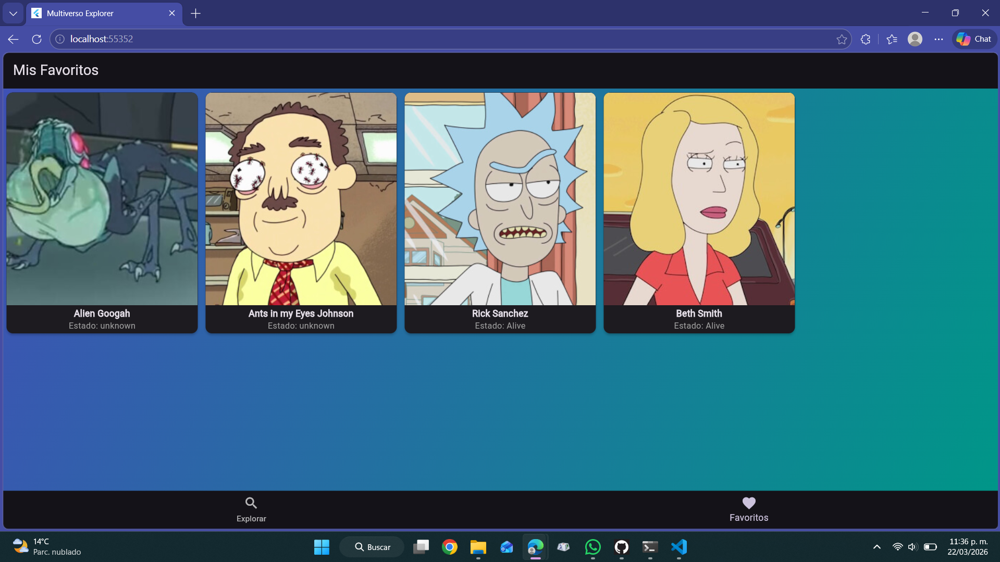

#  Multiverso Explorer: Rick and Morty Edition

Aplicación desarrollada en Flutter que permite explorar personajes de Rick and Morty, filtrarlos por estado y guardar favoritos de forma persistente.

---

##  Funcionalidades

-  Visualización de personajes desde una API
-  Filtro por estado (Vivo, Muerto, Desconocido)
-  Sistema de favoritos
-  Persistencia de datos con SharedPreferences
-  Navegación entre pantallas

---

##  Estructura del Proyecto

El proyecto está organizado en la carpeta `lib/` de la siguiente manera:

- **models/**
  - `character.dart`: Modelo de datos del personaje

- **services/**
  - `character_service.dart`: Consumo de la API

- **provider/**
  - `character_provider.dart`: Manejo de estado y favoritos

- **screens/**
  - `main_screen.dart`: Navegación principal
  - `search_screen.dart`: Pantalla de búsqueda
  - `favourites_screen.dart`: Pantalla de favoritos

---

##  Tecnologías Utilizadas

- Flutter
- Provider (manejo de estado)
- HTTP (consumo de API)
- SharedPreferences (persistencia de datos)

---

##  API utilizada

https://rickandmortyapi.com/api/character

---

##  Instalación y Ejecución

```bash
git clone https://github.com/LauraPulidoCBA/multiverso_explorer_rick_and_morty_edition.git
cd multiverso_explorer_rick_and_morty_edition
flutter pub get
flutter run -d web-server

```

##  Capturas de la aplicación





